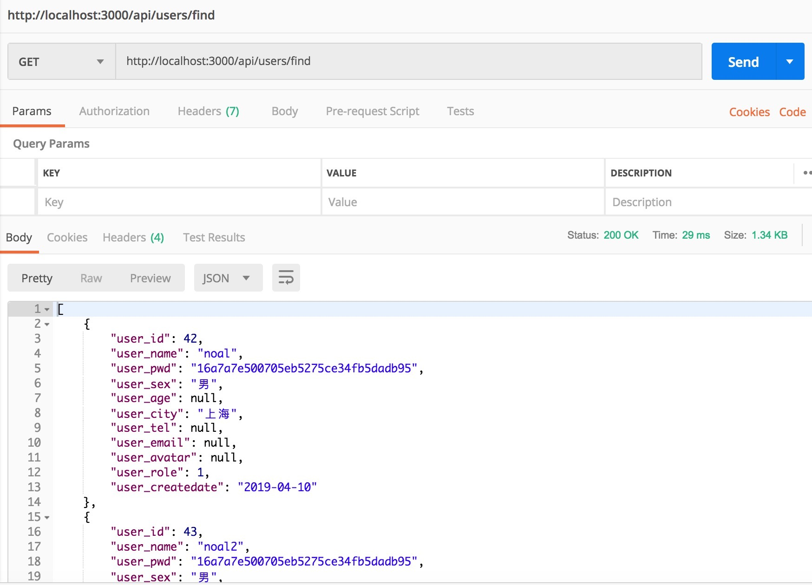
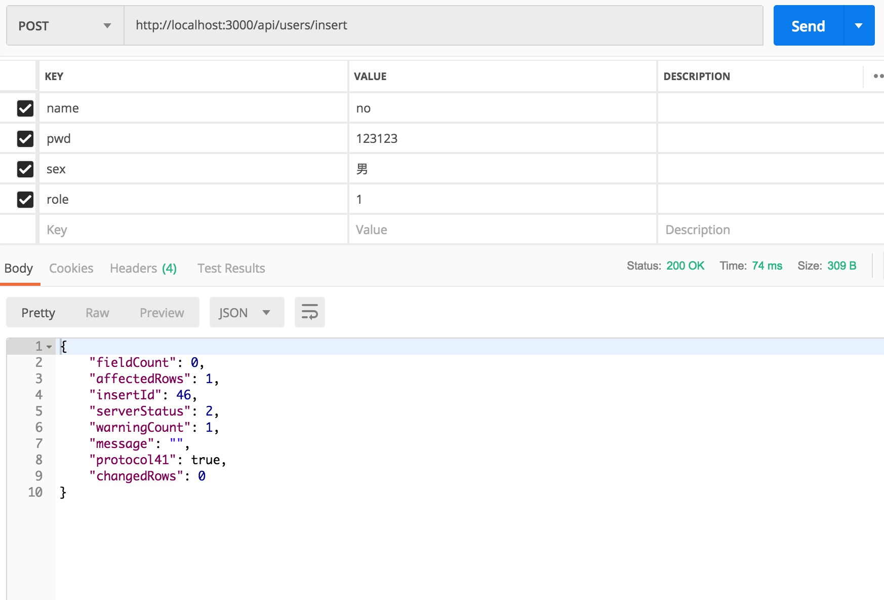
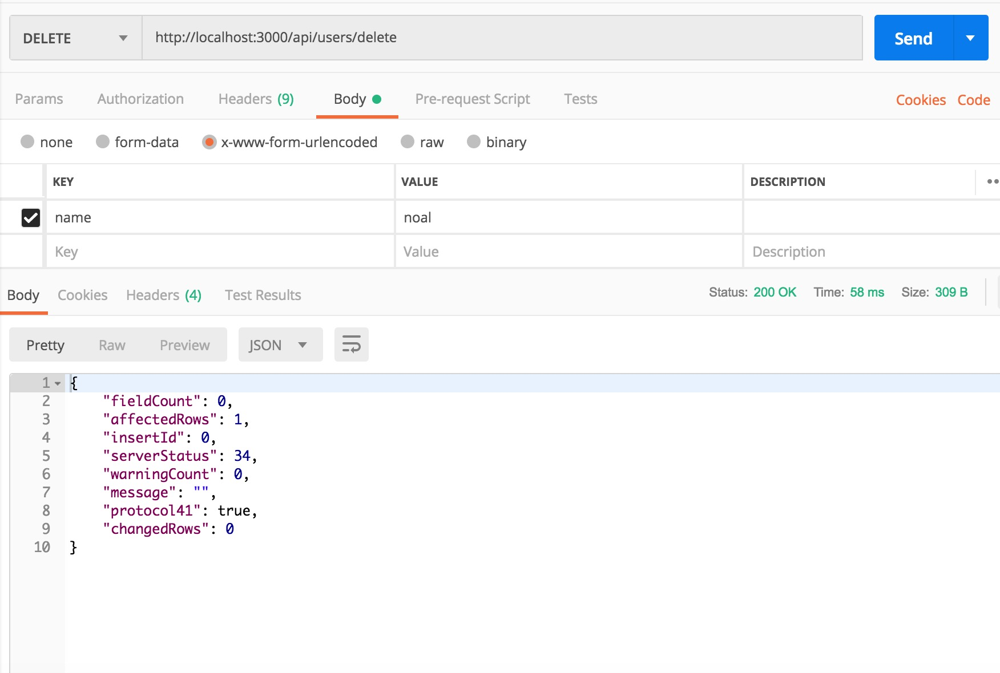
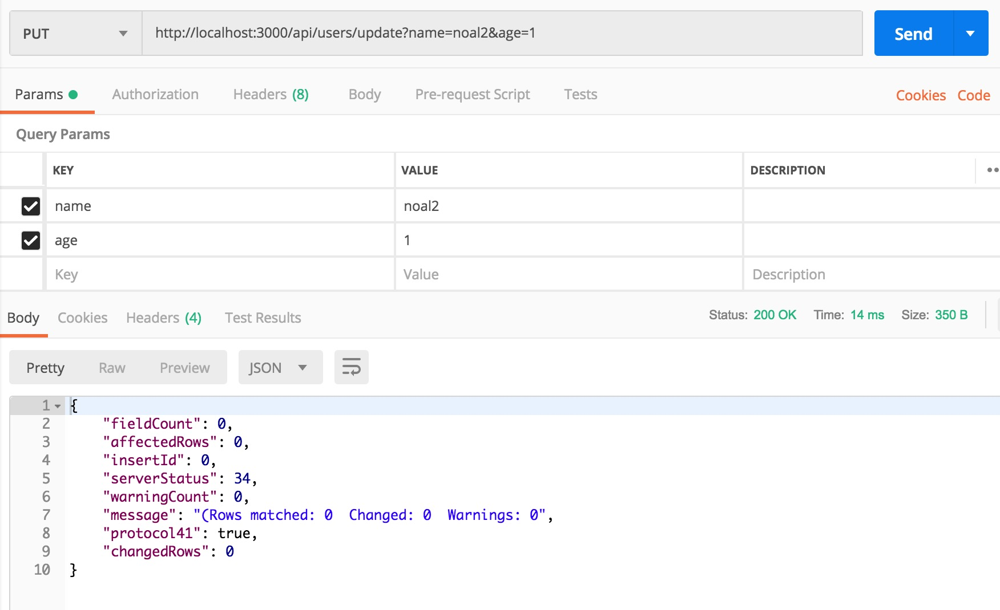

<!-- # koa2-mynote
## 安装koa生成器
```
npm install koa-generator -g
```
## 生成项目并安装依赖
```
koa2 test && cd test && npm install
``` -->
## 安装依赖
```
cd koa2-mynote && npm install
``` 
## 运行
```
npm run dev
```
浏览器打开 http://localhost:3000 就可以看见初始界面
## 编写路由
app.js
```
const api = require('./routes/api')
app.use(api.routes(), api.allowedMethods())
```
routes/api/index.js
```
const router = require('koa-router')()
const controller = require('../../controller/api')

router.prefix('/api')

router.get('/', async (ctx, next) => {
  ctx.body = 'api'
})

router.get('/find', controller.find)

router.post('/insert', controller.insert)

router.delete('/delete', controller.del)

router.put('/update', controller.update)

module.exports = router

```
## 编写控制器(controller)
controller/api/users.js
```
const service = require('../../service/api/users')

class usersController {
  static async find(ctx) {
    ctx.body = await service.findAll()
  }
  static async insert(ctx) {
    ctx.body = await service.insert(ctx.request.body)
  }
  static async delete(ctx) {
    ctx.body = await service.delete(ctx.request.body)
  }
  static async update(ctx) {
    ctx.body = await service.update(ctx.request.body)
  }
}

module.exports = usersController
```
## 编写业务逻辑(service)
service/api/users.js
```
const userModel = require('../../lib/users.js')

class usersService {
  static async findAll() {
    return await userModel.findAllData()
  }
  static async insert(data) {
    let v = [data.name, data.pwd, data.sex, data.role, new Date()]
    return await userModel.insertData(v)
  }
  static async delete(data) {
    return await userModel.deleteData(data.name)
  }
  static async update(data) {
    let v = [data.age, data.name]
    return await userModel.updateData(v)
  }
}

module.exports = usersService
```
## 安装mysql插件
```
npm i mysql --save
```
## 创建user表结构
```
CREATE TABLE `user` (
  `user_id` int(11) NOT NULL AUTO_INCREMENT,
  `user_name` varchar(100) CHARACTER SET utf8 COLLATE utf8_general_ci NOT NULL,
  `user_pwd` varchar(100) CHARACTER SET utf8 COLLATE utf8_general_ci NOT NULL,
  `user_sex` varchar(2) CHARACTER SET utf8 COLLATE utf8_general_ci NOT NULL,
  `user_age` int(3) DEFAULT NULL,
  `user_city` varchar(20) CHARACTER SET utf8 COLLATE utf8_general_ci DEFAULT NULL,
  `user_tel` int(13) DEFAULT NULL,
  `user_email` varchar(20) CHARACTER SET utf8 COLLATE utf8_general_ci DEFAULT NULL,
  `user_avatar` varchar(255) CHARACTER SET utf8 COLLATE utf8_general_ci DEFAULT NULL,
  `user_role` int(2) NOT NULL,
  `user_createdate` date NOT NULL,
  PRIMARY KEY (`user_id`)
) ENGINE=InnoDB AUTO_INCREMENT=48 DEFAULT CHARSET=utf8;
```
## 编写默认配置
config/default.js
```
const config = {
  // 数据库配置
  database: {
    DATABASE: 'noal',
    USERNAME: 'noal',
    PASSWORD: '123456',
    PORT: '3306',
    HOST: 'localhost'
  }
}

module.exports = config
```
## 编写数据库连接代码
lib/mysql.js
```
const mysql = require('mysql')
const config = require('../config/default.js')

const pool = mysql.createPool({
  host        : config.database.HOST,
  user        : config.database.USERNAME,
  password    : config.database.PASSWORD,
  database    : config.database.DATABASE,
  port        : config.database.PORT,
  dateStrings : true
})

let query = ( sql, values ) => {
  return new Promise(( resolve, reject ) => {
    pool.getConnection( (err, connection) => {
      if (err) {
        reject( err )
      } else {
        connection.query(sql, values, ( err, rows) => {
          if ( err ) {
            reject( err )
          } else {
            resolve( rows )
          }
          connection.release()
        })
      }
    })
  })
}

module.exports = query

```
## 编写增删改查sql
lib/users.js
```
const query = require('./mysql')

class usersSql {
  findAllData() {
    let  _sql = `SELECT * FROM user`
    return query(_sql)
  }
  insertData(v) {
    let _sql = `insert into user set user_name=?,
    user_pwd=?,user_sex=?,user_role=?,user_createdate=?;`
    // let  _sql = `insert into user set user_name = "${v.name}";`
    return query(_sql, v)
  }
  deleteData(name) {
    let _sql = `delete from user where user_name="${name}";`
    return query(_sql)
  }
  updateData(data) {
    let _sql = `update user set user_age=? where user_name=?;`
    return query(_sql, data)
  }
}

module.exports = new usersSql
```

## 请求接口



